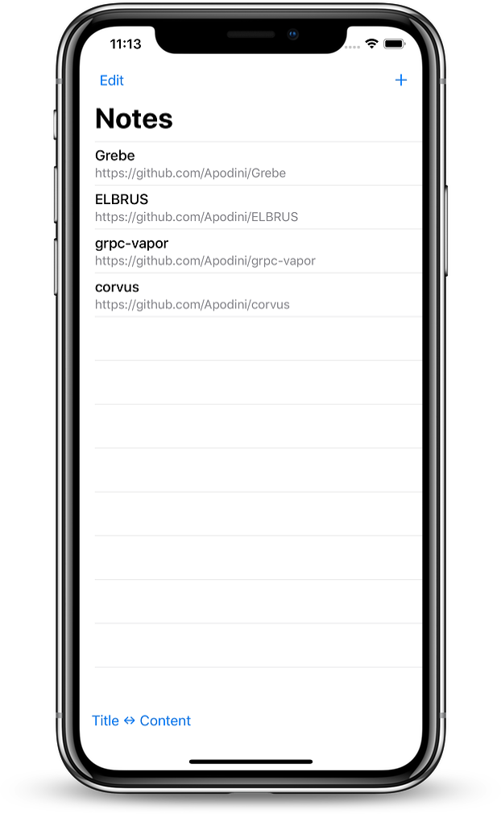
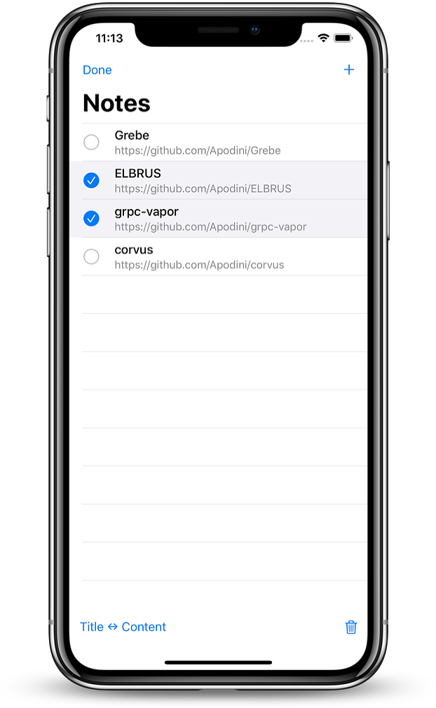

# Notes-Grebe
This repository contains a simple notes app and server build with Grebe.


## Screenshots

| Start View | Edit View |
| :-------------------------: | :-------------------------: |
|  |  |


## Usage

### 1. Start the server

- Open the `Notes-Server` Swift Package
- Build and run
- If everything goes well the console prints something like this: `server started on port 49141`

- Copy the port


### 2. Start the client

- Open the `Notes-gRPC-App.xcodeproj` file

- Open `API.swift`

- Paste the port and you are ready to go

  ```swift
  private let client = GClient<NotesServiceServiceClient>(
          target: .hostAndPort("localhost", 49141)
      )
  ```

  

## License
This project is licensed under the MIT License. See [License](https://github.com/Apodini/Notes-Grebe/blob/develop/LICENSE) for more information.